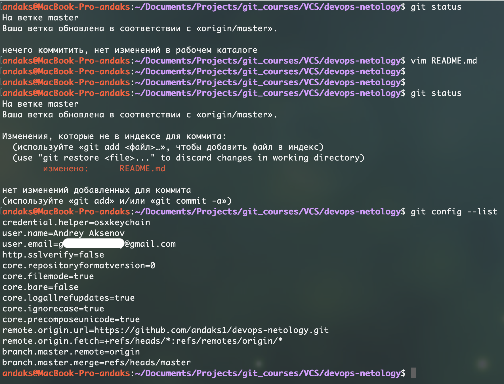
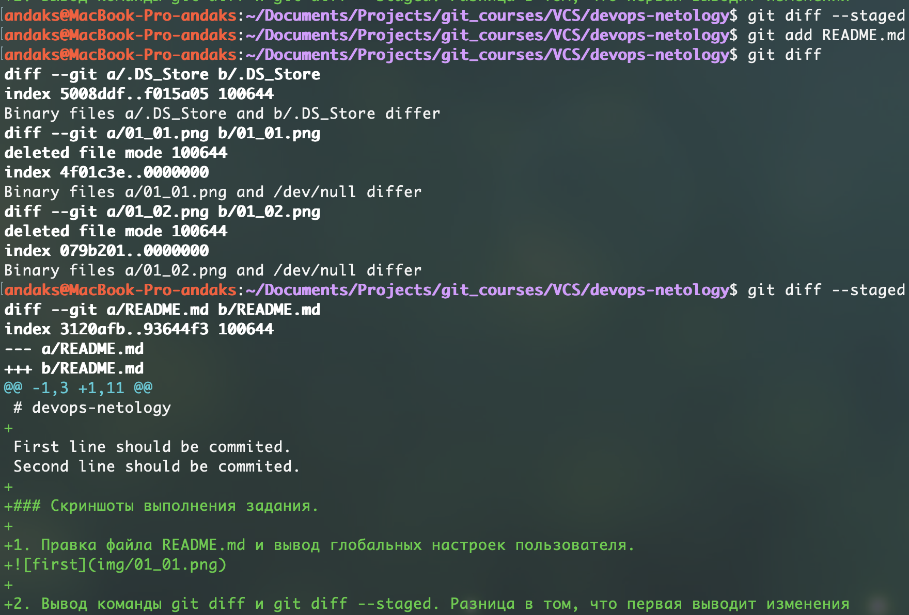
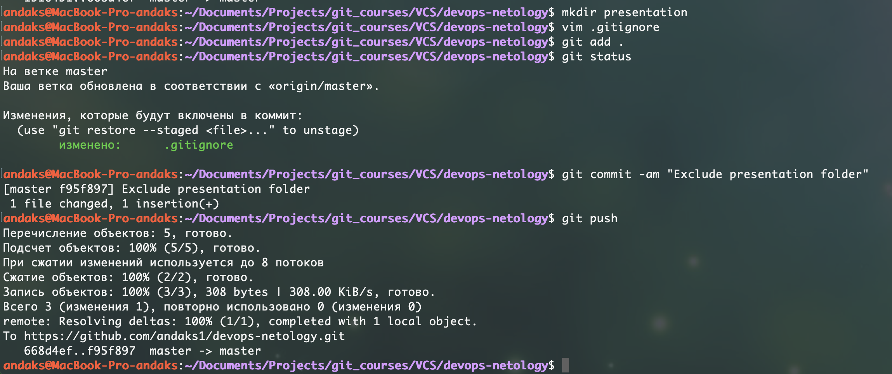
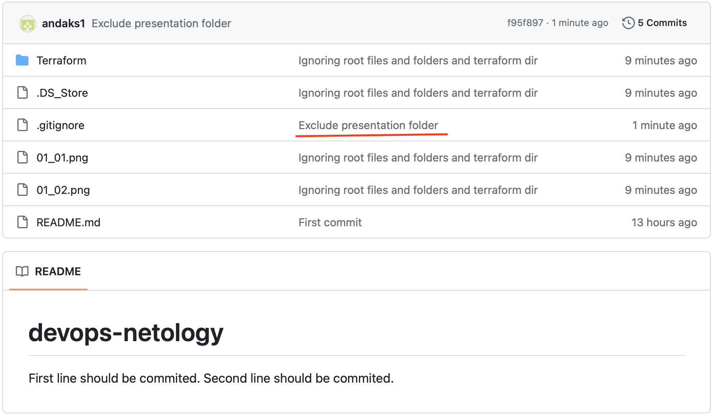
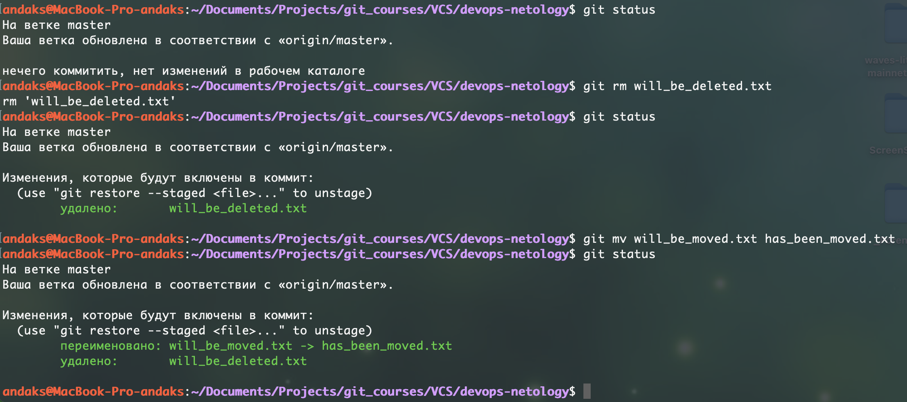

# devops-netology

### Скриншоты выполнения задания.

1. Правка файла README.md и вывод глобальных настроек пользователя.


2. Вывод команды `git diff` и `git diff --staged`. Разница в том, что первая выводит любые изменения в локальном репозитории, вторая выводит только то, что было подготовлено к отправке в удаленный репозиторий. Грубо говорят файлы, директории, включенные в команду git add.


3. Создали файл `.gitignore`, директорию `presentation` и внесли эти директорию в исключения для отправки в удаленный репозиторий.


Результат исключения директории. Коммит есть, директории нет.


4. Удаление и перемещение файлов. Команда `git rm` удаляет файл локально и при коммите из удаленного репозитория. Команда `rm mv` переименовывает файл по сути выполняя операцию удаления и добавления нового файла.

 
---

### Расшифрока файла `.gitignore` в директории `Terrafrom`
```BASH
**/.terraform/*		# исключить все файлы во всех поддиректориях .terraform

*.tfstate		# исключение любого файла, содержащего в расширении .tfstate
*.tfstate.*		# исключение любого файла, содержащего любое количество символов до .tfstate. и после.

crash.log		# исключить файлы crash.log
crash.*.log		# исключить файлы с любым именем между crash. и .log

*.tfvars		# исключить файлы с расширениями .tfvars
*.tfvars.json		# исключить файлы с расширениями .tfvars.json


override.tf 		# исключить все файлы override.tf
override.tf.json	# исклюить все файлы override.tf.json
*_override.tf		# исключить все файлы с окончанием имени файла _override.tf
*_override.tf.json	# исключить все файлы с окончанием имени файла _override.tf.json

# !example_override.tf	# если раскомментировать, то это будет исключением к строкам, описанным выше с файлами _override.tf. То есть исключить все *_override.tf файлы, кроме example_override.tf

# example: *tfplan*	# если раскомментировать, то это исключение всех файлов, содержащих в себе слово tfplan

.terraformrc		# исключение файлов .terraformrc
terraform.rc		# исключение файлов terraform.rc
```

---

